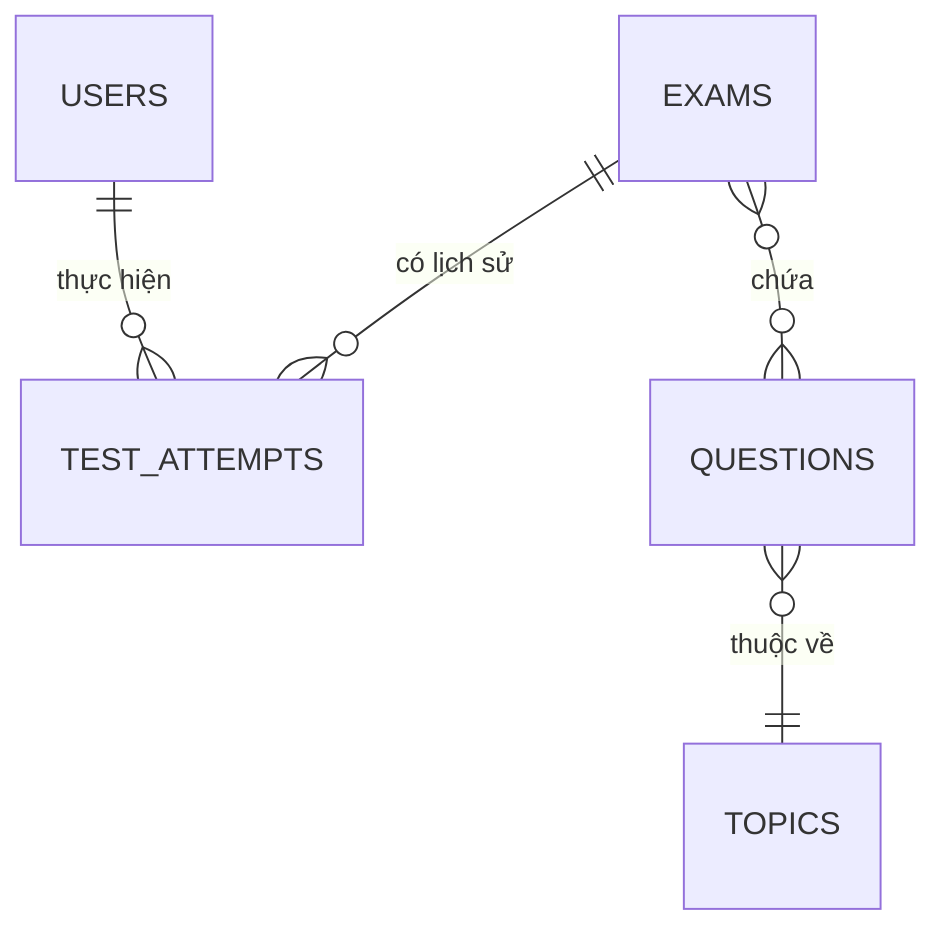

# HỆ THỐNG ÔN THI TOÁN THPT THÔNG MINH - WEBKIEMTRATOAN

Chào mừng bạn đến với tài liệu tổng quan dự án **Nền tảng Ôn thi Toán THPT Thông minh**. Đây là một hệ sinh thái học tập khép kín kết hợp lập trình Web hiện đại và Trí tuệ nhân tạo (AI/ML) nhằm hỗ trợ đắc lực cho học sinh luyện đề, đánh giá năng lực và cải thiện lỗ hổng kiến thức toán học.

---

## 1. Mục tiêu & Định hướng Nền tảng
- **Cá nhân hóa lộ trình học tập**: Phát hiện và lấp đầy các khoảng trống kiến thức toán lớp 11 và 12 của từng học sinh bằng công nghệ phân tích ma trận năng lực.
- **Trải nghiệm ôn luyện toàn diện**: Cung cấp các chế độ ôn tập thích ứng, luyện tập chủ đề cụ thể và thi thử nghiêm ngặt.
- **Tích hợp gia sư ảo**: Sử dụng mô hình ngôn ngữ lớn làm người dẫn dắt tư duy (Socratic Hint), không đưa ra lời giải ngay mà gợi mở cách làm để phát triển tư duy.

---

## 2. Kiến trúc Công nghệ
- **Frontend**: Dự kiến xây dựng bằng **React.js / Next.js** tối ưu hóa hiệu năng giao diện và trải nghiệm tương tác mượt mà.
- **Backend**: Xây dựng bằng **Node.js (Express)**, sử dụng **ES Modules** hiện đại cùng **Mongoose** để giao tiếp với cơ sở dữ liệu.
- **Database**: Sử dụng **MongoDB** (hỗ trợ cả chạy Docker Container cục bộ và kết nối đám mây MongoDB Atlas) giúp lưu trữ cấu hình đề thi linh hoạt dạng JSON/BSON và truy vấn tốc độ cao.
- **AI Engine**: Tích hợp các mô hình ngôn ngữ lớn (OpenAI GPT-4o, Claude 3.5 Sonnet) để sinh đề thích ứng và phân tích hành vi làm bài.

---

## 3. Các Tính năng Cốt lõi của Hệ thống

1. **Thi Thích Ứng (CAT - Computer Adaptive Testing)**
   - Đề thi không cố định. AI tự động điều chỉnh độ khó của câu hỏi tiếp theo dựa trên lịch sử trả lời đúng hoặc sai của học sinh trong thời gian thực.
2. **Gia sư Socratic (Socratic Tutor)**
   - Đưa ra các gợi ý từng bước (hints) định hướng cách tư duy thay vì đưa ngay đáp án cuối cùng, giúp học sinh phát triển năng lực tự giải quyết bài toán.
3. **Phân tích Điểm yếu & Lỗi nhiễu (Distractor Analysis)**
   - Phân tích nguyên nhân học sinh chọn các đáp án sai (Ví dụ: nhầm dấu đạo hàm, nhầm sang điểm cực tiểu...) để chỉ ra chính xác lỗ hổng tư duy.
4. **Sinh Đề Chống Học Vẹt (Parameterized Questions)**
   - AI tự động thay đổi thông số, hệ số trong các phương trình toán học gốc (giữ nguyên phương pháp giải) để kiểm tra mức độ hiểu bài thực sự của học sinh.
5. **Hệ thống Chống Gian Lận Nghiêm Ngặt (Anti-Cheat)**
   - Sử dụng Page Visibility API và Full-screen API để kiểm soát việc chuyển đổi tab, thoát màn hình rộng, và tự động khóa bài làm nếu số lần vi phạm vượt ngưỡng.

---

## 4. Thiết kế Chi tiết Cơ sở dữ liệu (5 Collections chính)

Hệ thống được tổ chức thành 5 bảng dữ liệu cốt lõi kết nối chặt chẽ với nhau:



### 4.1. Collection `Users` (Hồ sơ học sinh & Ma trận kiến thức)
Lưu thông tin cá nhân và ma trận kiến thức theo thời gian thực (Knowledge Matrix) để theo dõi năng lực học tập của học sinh qua thang điểm 1.0 - 10.0 cho từng chủ đề.
- **Cấu trúc dữ liệu mẫu**:
  ```json
  {
    "_id": "ObjectId",
    "full_name": "Nguyễn Văn A",
    "email": "vana@gmail.com",
    "grade_level": 12,
    "join_date": "2026-07-06T00:00:00Z",
    "knowledge_matrix": {
      "dao_ham": 8.5,
      "tich_phan": 4.0,       // AI phát hiện điểm yếu này để tập trung ôn tập
      "hinh_khong_gian": 6.0,
      "luong_giac_11": 5.5
    },
    "total_tests_taken": 15,
    "status": "active"
  }
  ```

### 4.2. Collection `Questions` (Ngân hàng câu hỏi thông minh)
Kho lưu trữ câu hỏi toán học định dạng LaTeX, bao gồm đáp án nhiễu, phân tích từ AI, lời giải chi tiết và vector embedding (1536 chiều của OpenAI) hỗ trợ tìm kiếm ngữ nghĩa.
- **Cấu trúc dữ liệu mẫu**:
  ```json
  {
    "_id": "ObjectId",
    "content": "Cho hàm số $y = x^3 - 3x + 2$. Điểm cực đại của đồ thị hàm số là?",
    "options": {
      "A": "$(1,0)$", "B": "$(-1,4)$", "C": "$(-1,0)$", "D": "$(1,4)$"
    },
    "correct_answer": "B",
    "metadata": {
      "topic": "dao_ham",
      "sub_topic": "cuc_tri_ham_so",
      "difficulty_score": 6,
      "source": "THPT_QG_2023"
    },
    "ai_analysis": {
      "distractor_analysis": {
        "A": "Học sinh tính nhầm sang điểm cực tiểu.",
        "C": "Học sinh nhầm dấu khi giải phương trình y'=0."
      },
      "socratic_hint": "Tính đạo hàm y' trước, sau đó tìm nghiệm y'=0 và lập bảng biến thiên.",
      "solution_steps": "Bước 1: y' = 3x^2 - 3. Bước 2: y'=0 => x = 1 hoặc x = -1..."
    },
    "embedding": [0.124, -0.532, 0.992]
  }
  ```

### 4.3. Collection `Topics` (Sơ đồ tri thức - Knowledge Graph)
Quản lý cây thư mục bài học, chương trình và quy định các điều kiện tiên quyết (Prerequisites) cần học trước khi học chủ đề mới.
- **Cấu trúc dữ liệu mẫu**:
  ```json
  {
    "_id": "ObjectId",
    "topic_id": "cuc_tri_ham_so",
    "name": "Cực trị của hàm số",
    "chapter": "Ứng dụng đạo hàm",
    "grade": 12,
    "prerequisites": ["tinh_dao_ham", "xet_dau_da_thuc"]
  }
  ```

### 4.4. Collection `Exams` (Khung đề thi)
Lưu trữ thông tin bài kiểm tra, cấu hình thời gian và chế độ bảo mật chống gian lận.
- **Cấu trúc dữ liệu mẫu**:
  ```json
  {
    "_id": "ObjectId",
    "title": "Đề Khảo sát chất lượng Toán 12 - Lần 1",
    "exam_type": "diagnostic",
    "time_limit_minutes": 90,
    "questions": ["ObjectId_CauHoi_1", "ObjectId_CauHoi_2"],
    "security_settings": {
      "require_fullscreen": true,
      "max_tab_switches": 3
    }
  }
  ```

### 4.5. Collection `TestAttempts` (Lịch sử làm bài & Phân tích chống gian lận)
Lưu vết chi tiết thời gian làm từng câu hỏi, các lần thoát màn hình/chuyển tab (Anti-cheat logs) và kết quả phân tích mức độ hiểu bài cuối cùng để cập nhật lại vào `knowledge_matrix` của học sinh.
- **Cấu trúc dữ liệu mẫu**:
  ```json
  {
    "_id": "ObjectId",
    "user_id": "ObjectId_User",
    "exam_id": "ObjectId_Exam",
    "start_time": "2026-07-06T19:00:00Z",
    "end_time": "2026-07-06T20:30:00Z",
    "details": [
      { "question_id": "ObjectId_CauHoi_1", "selected_answer": "B", "is_correct": true, "time_spent_seconds": 45 }
    ],
    "anti_cheat_logs": {
      "tab_switch_count": 1,
      "fullscreen_exit_count": 0,
      "suspicious_flags": ["Thời gian làm câu 1 quá nhanh"]
    },
    "result_summary": {
      "total_score": 8.0,
      "topic_performance": {
        "dao_ham": { "correct": 8, "total": 10 }
      }
    }
  }
  ```

---

## 5. Hướng dẫn Cài đặt & Khởi chạy Nhanh

### Bước 1: Khởi động cơ sở dữ liệu MongoDB (Docker Compose)
Nếu bạn muốn phát triển cục bộ và chưa cài đặt MongoDB trên máy, hãy chạy lệnh dưới đây để khởi chạy container MongoDB trên cổng `27018` (được cấu hình để tránh xung đột với cổng MongoDB mặc định):
```bash
docker compose up -d
```
*Lưu ý: MongoDB Docker container đã được gắn sẵn script `init-db.js` để tự động khởi tạo database và dữ liệu mẫu toán học ngay khi chạy lần đầu.*

### Bước 2: Cấu hình biến môi trường
Mở tệp `.env` ở thư mục gốc của dự án để cấu hình chuỗi kết nối:
- Để kết nối MongoDB Atlas (đám mây), nhập chuỗi kết nối của bạn:
  ```env
  MONGO_URI=mongodb+srv://<username>:<password>@<cluster-url>/webkiemtratoan?retryWrites=true&w=majority
  ```
- Để kết nối MongoDB Docker cục bộ:
  ```env
  MONGO_URI=mongodb://127.0.0.1:27018/webkiemtratoan
  ```

### Bước 3: Cài đặt thư viện Node.js
Chạy lệnh sau để tải các package thiết yếu (`express`, `mongoose`, `dotenv`, `nodemon`):
```bash
npm install
```

### Bước 4: Nạp dữ liệu mẫu vào Database (Seeding)
Chạy script seeding để nạp toàn bộ cấu trúc 5 bảng dữ liệu mẫu ở phần 4 trực tiếp vào database đã cấu hình trong tệp `.env` của bạn (hỗ trợ cả Local và Atlas):
```bash
node seed.js
```

### Bước 5: Chạy Backend Server
Khởi động máy chủ Express ở chế độ phát triển (chạy qua Nodemon để tự động cập nhật khi sửa mã nguồn):
```bash
npm run dev
```
Sau đó, bạn có thể truy cập các đường dẫn API thử nghiệm tại:
- `http://localhost:3000/` (Trang thông tin chung)
- `http://localhost:3000/api/users` (Lấy danh sách người dùng)
- `http://localhost:3000/api/questions` (Lấy ngân hàng câu hỏi)
- `http://localhost:3000/api/exams` (Lấy đề kiểm tra, tự động kết nối thông tin câu hỏi)
- `http://localhost:3000/api/test-attempts` (Lịch sử làm bài thi chi tiết)
